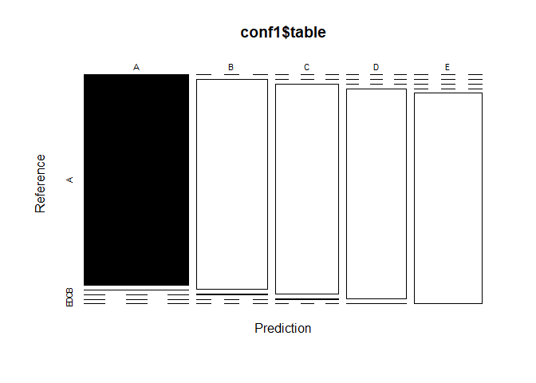

Please refer the readme file for more background info on this project

The aim of this project is to predict the manner in which 6 participants do 
various classes of exercise 

After downloading the training and test data 

The steps involved in the prediction method are as follows
1)find near zero covariates 
2)Remove NA observations for the remaining covariates
3)Perform cross validation
4)Build at least two models on the cross validted sets
5)Predict using the model and the test set
6)Use these predictions to generate an accuracy measure and out of sample error
7)perform predictions on the Given datasets


Step1

Downloading required packages 
ggplot2,caret,rpart,rpart.plot,random forest,corrplot


```r
library(caret)
```

```
## Loading required package: lattice
```

```
## Loading required package: ggplot2
```

```r
library(rpart)
library(rpart.plot)
library(randomForest)
```

```
## randomForest 4.6-14
```

```
## Type rfNews() to see new features/changes/bug fixes.
```

```
## 
## Attaching package: 'randomForest'
```

```
## The following object is masked from 'package:ggplot2':
## 
##     margin
```

```r
library(corrplot)
```

```
## corrplot 0.84 loaded
```


Step 2

Downloading required data for training and test set


```r
UrlTrain <- "http://d396qusza40orc.cloudfront.net/predmachlearn/pml-training.csv"
UrlTest  <- "http://d396qusza40orc.cloudfront.net/predmachlearn/pml-testing.csv"

training<-read.csv(url(UrlTrain))
testing<-read.csv(url(UrlTest))
```


Check for NA values and remove them


```r
Allna1<-sapply(training,function(x) mean(is.na(x)))>0.95
Allna2<-sapply(testing,function(x) mean(is.na(x)))>0.95

training<-training[,Allna1==FALSE]
testing<-testing[,Allna2==FALSE]
```

Now we keep aside the testing data set and create a partition in training set for our model 
building


```r
intrain<-createDataPartition(training$classe,p=0.7,list = FALSE)
trainset<-training[intrain, ]
testset<-training[-intrain,]
dim(trainset)
```

```
## [1] 13737    93
```

```r
dim(testset)
```

```
## [1] 5885   93
```

Removing variables with near zero effect on the output


```r
nzv<-nearZeroVar(trainset)
trainset<-trainset[,-nzv]
testset<-testset[,-nzv]
dim(trainset)
```

```
## [1] 13737    59
```

```r
dim(testset)
```

```
## [1] 5885   59
```

Since column 1-5 contain only identification parameters such as name and id we will also remove them


```r
trainset<-trainset[,-(1:5)]
testset<-testset[,-(1:5)]
dim(trainset)
```

```
## [1] 13737    54
```

```r
dim(testset)
```

```
## [1] 5885   54
```

Exploratory analysis


```r
plot(trainset$classe,col="orange", main="Levels of the variable classe", xlab="classe levels", ylab="Frequency")
```

<!-- -->

The plot above shows that Level A is the most frequent classe. D appears to be the least frequent one.


Step 3
Building random forest with simple crossvalidation


```r
set.seed(111)
controlRF<-trainControl(method = "cv",number = 3,verboseIter = FALSE)

model1<-train(classe~.,method="rf",data = trainset,trControl=controlRF)
model1$finalModel
```

```
## 
## Call:
##  randomForest(x = x, y = y, mtry = param$mtry) 
##                Type of random forest: classification
##                      Number of trees: 500
## No. of variables tried at each split: 27
## 
##         OOB estimate of  error rate: 0.24%
## Confusion matrix:
##      A    B    C    D    E  class.error
## A 3904    1    0    0    1 0.0005120328
## B    7 2649    2    0    0 0.0033860045
## C    0    5 2390    1    0 0.0025041736
## D    0    0    9 2242    1 0.0044404973
## E    0    0    0    6 2519 0.0023762376
```


```r
model1$finalModel
```

```
## 
## Call:
##  randomForest(x = x, y = y, mtry = param$mtry) 
##                Type of random forest: classification
##                      Number of trees: 500
## No. of variables tried at each split: 27
## 
##         OOB estimate of  error rate: 0.24%
## Confusion matrix:
##      A    B    C    D    E  class.error
## A 3904    1    0    0    1 0.0005120328
## B    7 2649    2    0    0 0.0033860045
## C    0    5 2390    1    0 0.0025041736
## D    0    0    9 2242    1 0.0044404973
## E    0    0    0    6 2519 0.0023762376
```

Testing this model on testset data


```r
predictions1<-predict(model1,testset)
conf1<-confusionMatrix(predictions1,testset$classe)
conf1
```

```
## Confusion Matrix and Statistics
## 
##           Reference
## Prediction    A    B    C    D    E
##          A 1674    2    0    0    0
##          B    0 1137    3    0    0
##          C    0    0 1023    3    0
##          D    0    0    0  961    1
##          E    0    0    0    0 1081
## 
## Overall Statistics
##                                           
##                Accuracy : 0.9985          
##                  95% CI : (0.9971, 0.9993)
##     No Information Rate : 0.2845          
##     P-Value [Acc > NIR] : < 2.2e-16       
##                                           
##                   Kappa : 0.9981          
##                                           
##  Mcnemar's Test P-Value : NA              
## 
## Statistics by Class:
## 
##                      Class: A Class: B Class: C Class: D Class: E
## Sensitivity            1.0000   0.9982   0.9971   0.9969   0.9991
## Specificity            0.9995   0.9994   0.9994   0.9998   1.0000
## Pos Pred Value         0.9988   0.9974   0.9971   0.9990   1.0000
## Neg Pred Value         1.0000   0.9996   0.9994   0.9994   0.9998
## Prevalence             0.2845   0.1935   0.1743   0.1638   0.1839
## Detection Rate         0.2845   0.1932   0.1738   0.1633   0.1837
## Detection Prevalence   0.2848   0.1937   0.1743   0.1635   0.1837
## Balanced Accuracy      0.9998   0.9988   0.9982   0.9983   0.9995
```

Finding the out sample error in this case

As you can see from the cofusion matrix the out sample error
for classe A=1/1674=0.000597
for classe B=8/1139=0.0070
for Classe C=3/1026=0.0029
for Classe D=2/964=0.002074
for Classe E=2/1082=0.00184


```r
plot(conf1$table,col=conf1$byClass,main("Accuracy=0.998"))
```

<!-- -->

Since Random Forest with cross validation gives a pretty high accuracy we will be using
this model to predict the test data for the project quiz


```r
predictions2<-predict(model1,testing)
predictions2
```

```
##  [1] B A B A A E D B A A B C B A E E A B B B
## Levels: A B C D E
```


